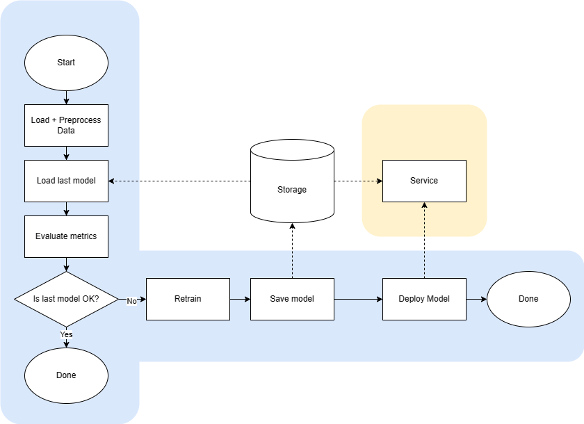

# Demo ML Ops

This is a demo about ML Ops. We use the data from [machine predictive maintenance classificatio](https://www.kaggle.com/datasets/shivamb/machine-predictive-maintenance-classification)

The architecture is simple and minimal, without any need for containerization, etc

# Prerequisites

- Bash
- Python 3.10.0
- Venv
- Pip

# Prepare the environment

```bash
source project.sh
```

# Simple ML Ops



## Start ML Ops pipeline

```bash
source project.sh
python automatic.py
```

## Serve ML Model

```bash
source project.sh
./serve.sh
```

# Other interesting commands


```bash
# Open Mlflow UI (You can release and tag model)
mlflow ui

# Serve model /coba/Staging
mlflow models serve -m 'models:/coba/Staging'

# Hit end point
# https://www.mlflow.org/docs/latest/quickstart_mlops.html
curl -X POST 'http://localhost:5000/invocations' \
-H 'Content-Type: application/json' \
-d '{"dataframe_split": {"data": [[2, 298.4, 308.9, 1782, 23.9, 24]]}}'

# Create docker container of your model
mlflow models build-docker --model-uri "models:/coba/Staging" --name "qs_mlops"

# Run model docker container
docker run -p 5002:8080 qs_mlops
```